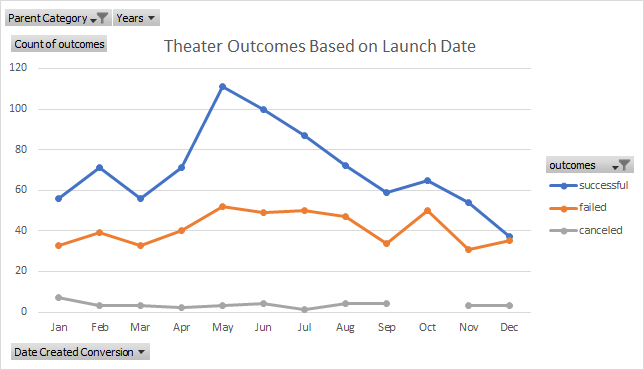
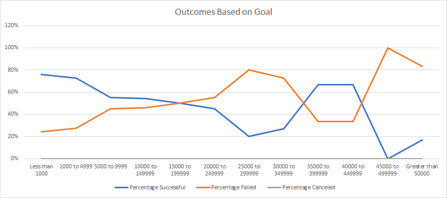

# Kickstarting with Excel

## Overview of Project

### Purpose

Our client, Louise, is looking to raise money for a theater production using Kickstarter. After obtaining Kickstarter data, we performed an analysis on it to determine the relationship between the outcome of the theater category based on launch date as well as outcome based on the campaign goal. In the end, we will make a recommendation to Louise that will give her the best chance at a successful theater Kickstarter campaign. Our recommendation is based on the available data. 

## Analysis and Challenges

### Analysis of Outcomes Based on Launch Date

We began by evaluating the data based on launch date to see if there was any seasonal trend that my indicate a higher success during certain months of the year. For this analysis, we used the YEAR function to convert the "short date" format of the launch date into the year it was launched. Next, we created a Pivot Table using categorized by month on the x-axis and the outcomes (successful, failed, canceled) on the y-axis. The chart is then populated with the count of each outcome per each month of the year. Because Louise is interested in the parent category of theater, the table is filtered by such.

We then created a line chart, titled "Theater Outcomes by Launch Date", in order to have a visual representation of the filtered data. See below chart for details.

### Analysis of Outcomes Based on Goals

We further filtered the data to examine the subcategory of plays. With this data, we examined the percentage of successful, failed, and canceled play Kickstarter campaigns based on the campaigns goal. We did this by categorizing the goals into 12 groups. Each group was a $5000 range beginning with a goal of less than $1,000 and ending with a goal of $50,000 or greater. From there, we determined the number of outcomes in each of the 12 categories using the COUNTIFS function. We then used the SUM function to calculate the total number of play campaigns per goal range. Next, we determined the percentage of each outcome by dividing each outcome category count by the total number of outcomes for that goal range. The column was then formatted as a percentage. 

We then used this data to create a "Outcomes Based on Goals" chart. See below. 

### Challenges and Difficulties Encountered

The most challenging part was determining what data to use in the COUNTIFS formula for the Outcomes Based on Goals worksheet.

## Results

### Results of Outcomes Based on Launch Date

Examining the Outcomes based on Launch Date data, it appears that May is the most successful month for theater category, with 111 out of 166 successful campaigns. The least desirable month for the theater campaign seems to be December, with nearly as many failed campaigns as successful ones (35 and 37 respectively). May also has the most theater campaigns of any month and December the least. Overall, the theater category has and extremely low cancellation outcome, just 37 out of a total 1369 event were canceled.

### Results of Outcomes Based on Goals

Looking at the Outcomes Based on Goals data, the most successful play campaigns have a goal within the $45,000 to $49,999 range. These campaigns were 100% successful during the years examined in the data provided.

### Limitations and Recommendations

One limitation of this dataset is understanding why the campaigns launch when they do. While most are launched in May, June and July are the next highest months. Is this due to good marketing or something else? Why do we see a decrease in launches later in the year?. Another potential limitation is some categoreis appearing more successful becuase they are "popular" meaning there are more overall of a ceratin category of campaigns versus another. 

One other graph we may want to create is the theater/play outcome based on country. In general, it appears the theater category is successful but depending on which county Louise is looking to raise money for her production, plays may not have as successful campaigns in some countries as they do in others. A second thing we may want to chart is genre of plays (i.e. comedy, tragedy, etc.) vs. outcome to see if there is a particular one that fairs better than the others. We may also want to examine the average number of backers for succesfful and unsucessful campaigns. This can help us to determine if successful campaigns have more backers than unsuccessful ones or if successful campaign backers donate a higher dollar amount per backer than the unsucessful campaigns. We could also chart the duration of a campaign. Does the longer a campaign run increase it's chances of being successful?

